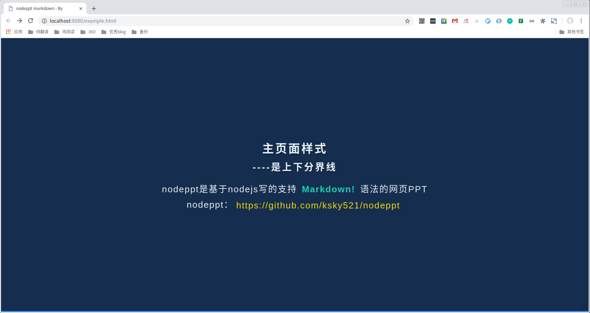

[slide]
# nodeppt-docker
这是一个使用nodeppt写ppt的项目，此项目解决了nodeppt的js和css的依赖问题，并且尝试将静态文件打包在Docker镜像中。
```shell
docker pull hellojukay/nodeppt-docker
docker run --name ppt -p 8080:80 hellojukay/nodeppt-docker
```

[slide]
# 依赖
* nodeppt 
* docker

[slide]
# 如何使用本项目

[slide]
## clone这个仓库
```shell
git clone https://github.com/hellojukay/nodeppt-docker.git
```
修改REMADNE.md文件，或者直接在项目根目录下编写markdown格式文件，ppt语法请参考[nodeppt](https://github.com/ksky521/nodeppt)

[slide]
## 编译dockerfile
```shell
docker built -t ppt .
```
[slide]
## 启动容器
```shell
docker run -itd --name ppt -p 80:80 ppt
```
